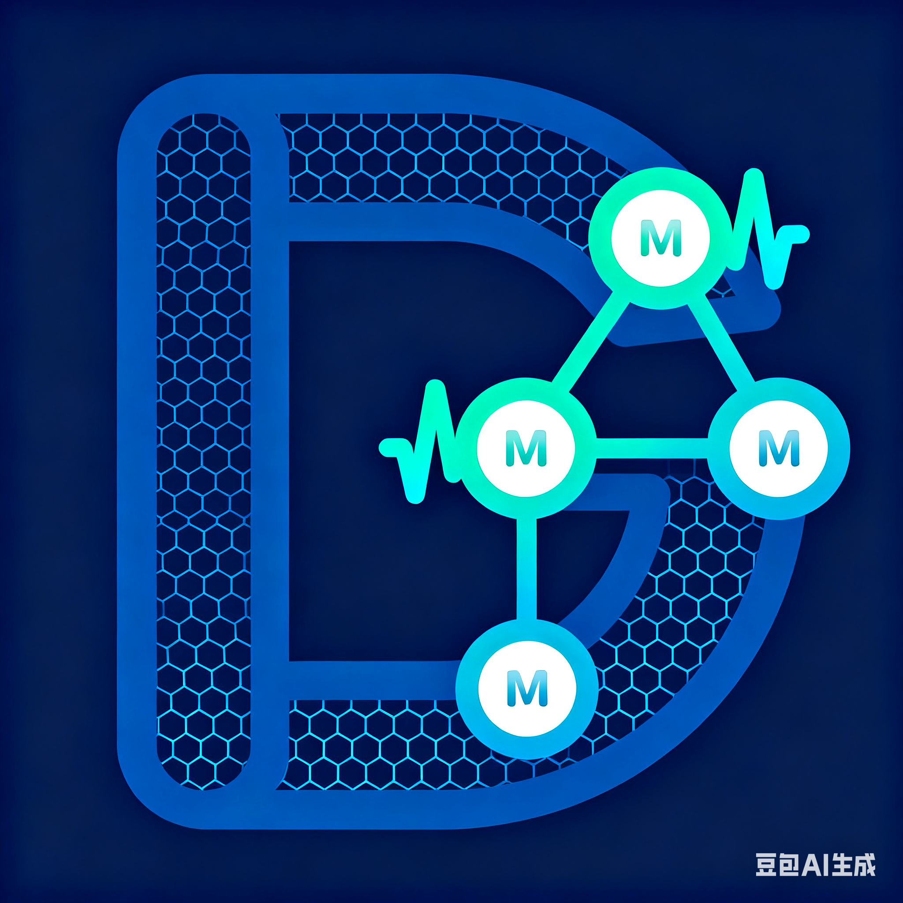

<p align="center">
  
</p>

<h1 align="center">emqx-go</h1>

<p align="center">
  <strong>Proof-of-Concept Implementation of the EMQX MQTT broker, rewritten in Go</strong>
</p>

<p align="center">
  <a href="https://github.com/turtacn/emqx-go/actions"></a>
  <a href="https://github.com/turtacn/emqx-go/blob/main/LICENSE"></a>
  <a href="https://golang.org/"></a>
  <a href="https://github.com/turtacn/emqx-go/releases"></a>
  <a href="https://goreportcard.com/report/github.com/turtacn/emqx-go"></a>
</p>

<p align="center">
  <a href="README-zh.md">简体中文</a> |
  <a href="#installation">Installation</a> |
  <a href="docs/architecture.md">Architecture</a> |
  <a href="docs/apis.md">API Reference</a> |
  <a href="#contributing">Contributing</a>
</p>

---

# EMQX-Go: A Golang Implementation of EMQX

This repository is a proof-of-concept implementation of the EMQX MQTT broker, rewritten in Go. The project aims to replicate the core functionalities of the original Erlang-based EMQX, including MQTT connection handling, message publishing and subscribing, session management, and clustering.

## 🌟 Features

*   **MQTT Broker**: Core functionalities such as `CONNECT`, `SUBSCRIBE`, and `PUBLISH` are supported.
*   **Actor-Based Concurrency**: Inspired by OTP, the system uses an actor model for managing client sessions and other components, providing a robust and scalable architecture.
*   **Clustering**: Nodes can be clustered together for high availability and distributed message routing.
*   **Kubernetes Discovery**: Automatic peer discovery in a Kubernetes environment using the Kubernetes API.
*   **gRPC for Inter-Node Communication**: Efficient and strongly-typed communication between cluster nodes.

## 🚀 Getting Started

### Prerequisites

*   Go (version 1.20 or later)
*   An MQTT client (e.g., [MQTTX](https://mqttx.app/) or `mosquitto_clients`)

### Building and Running

1.  **Clone the repository**:
    ```sh
    git clone https://github.com/turtacn/emqx-go.git
    cd emqx-go
    ```

2.  **Build the application**:
    ```sh
    go build ./cmd/emqx-go
    ```

3.  **Run the broker**:
    ```sh
    ./emqx-go
    ```
    The broker will start and listen for MQTT connections on port `1883` and gRPC connections on port `8081`.

### Connecting an MQTT Client

You can connect to the broker using any standard MQTT client.

*   **Host**: `localhost`
*   **Port**: `1883`

Once connected, you can subscribe to topics and publish messages to test the broker's functionality.

## 🏗️ Project Structure

The repository is organized into the following main directories:

*   `cmd/emqx-go`: The main application entrypoint.
*   `pkg/`: Contains all the core packages of the broker.
    *   `actor`: A simple actor model implementation.
    *   `broker`: The central MQTT broker logic.
    *   `cluster`: Components for clustering, including the manager, gRPC server, and client.
    *   `connection`: Manages individual client connections.
    *   `discovery`: Service discovery, with a Kubernetes implementation.
    *   `proto`: Protobuf definitions for cluster communication.
    *   `protocol`: MQTT protocol parsing and encoding.
    *   `session`: Manages client sessions.
    *   `storage`: A key-value storage interface and in-memory implementation.
    *   `supervisor`: A one-for-one supervisor for managing actor lifecycles.
    *   `topic`: A store for managing topic subscriptions.
    *   `transport`: Manages the underlying network transport (TCP).
*   `docs/`: Contains additional documentation.
*   `k8s/`: Kubernetes manifests for deploying the application.
*   `PLAN.md`: A detailed plan outlining the project's development phases and goals.

## 📚 Documentation

The source code is thoroughly documented using GoDoc conventions. You can generate and view the documentation locally by running:

```sh
godoc -http=:6060
```

Then, open your browser to `http://localhost:6060/pkg/github.com/turtacn/emqx-go/`.